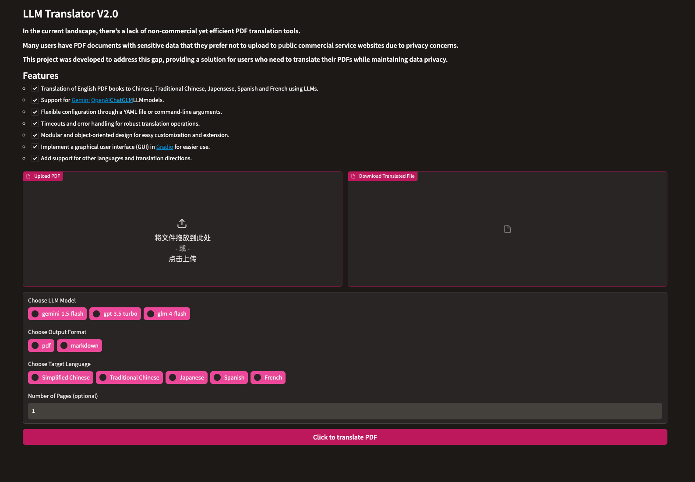

# LLM-Translator-V2.0
LLM-Translator V2.0, improved based on the V1.0 at https://github.com/DjangoPeng/openai-quickstart/tree/main/openai-translator

<p align="center">
    <br> English | <a href="README-CN.md">中文</a>
</p>

## Introduction

LLM Translator is an AI-powered translation tool designed to translate English PDF books to Chinese. The tool leverages large language models (LLMs) like Gemini 1.5 Flash, ChatGLM and OpenAI's GPT-3.5 Turbo for translation. It's built in Python and has a flexible, modular, and object-oriented design. 

## Why this project

In the current landscape, there's a lack of non-commercial yet efficient PDF translation tools. Many users have PDF documents with sensitive data that they prefer not to upload to public commercial service websites due to privacy concerns. This project was developed to address this gap, providing a solution for users who need to translate their PDFs while maintaining data privacy.

## User Interface



### Sample Results

The LLM Translator is still in its early stages of development, and I'm actively working on adding more features and improving its performance. We appreciate any feedback or contributions!


<p align="center">
    <em>"The Old Man and the Sea"</em>
</p>

## Features


- [X]  Translation of English PDF books to Chinese, Traditional Chinese, Japensese, Spanish and French using LLMs.
- [X]  Support for [Gemini](https://deepmind.google/technologies/gemini/flash/),[OpenAI](https://platform.openai.com/docs/models) and [ChatGLM](https://github.com/THUDM/ChatGLM-6B) LLM models.
- [X]  Flexible configuration through a YAML file or command-line arguments.
- [X]  Timeouts and error handling for robust translation operations.
- [X]  Modular and object-oriented design for easy customization and extension.
- [X]  Implement a graphical user interface (GUI) in [Gradio](https://www.gradio.app/) for easier use.
- [X]  Add support for other languages and translation directions.

## Getting Started

### Environment Setup

1.Clone the repository `git clone git@github.com:joceejoy/LLM-Translator-V2.0.git`.

2.The `LLM-Translator` requires Python 3.6 or later. Install the dependencies with `pip install -r requirements.txt`.

3.Set up your OpenAI API key(`$OPENAI_API_KEY`), ChatGLM API key (`$GLM_API_KEY`) and Gemini API Key(`$GEMINI_API_KEY`) You can add it to your environment variables.

### Usage

You can use LLM-Translator either by specifying a configuration file or by providing command-line arguments.

#### Using a configuration file:

Adapt `config.yaml` file with your settings:

```yaml
OpenAIModel:
  model: "gpt-3.5-turbo"
  api_key: "your_openai_api_key"

GLMModel:
  model: "glm-4-flash"
  api_key: "your_glm_api_key"

 GeminiModel:
  model: "gemini-1.5-flash"
  api_key: "your_gemini_api_key" 

common:
  book: "tests/test.pdf"
  file_format: "markdown"
```

Then run the tool:

```bash
python ai_translator/app.py
```


#### Using command-line arguments:

You can also specify the settings directly on the command line. Here's an example of how to use the 3 models:

```bash
# Set your api_key as an env variable
export OPENAI_API_KEY="sk-xxx"
export GEMINI_API_KEY="xxx"
export GLM_API_KEY="xxx"
python ai_translator/app.py
```

## License

This project is licensed under the GPL-3.0 License. See the [LICENSE](LICENSE) file for details.
